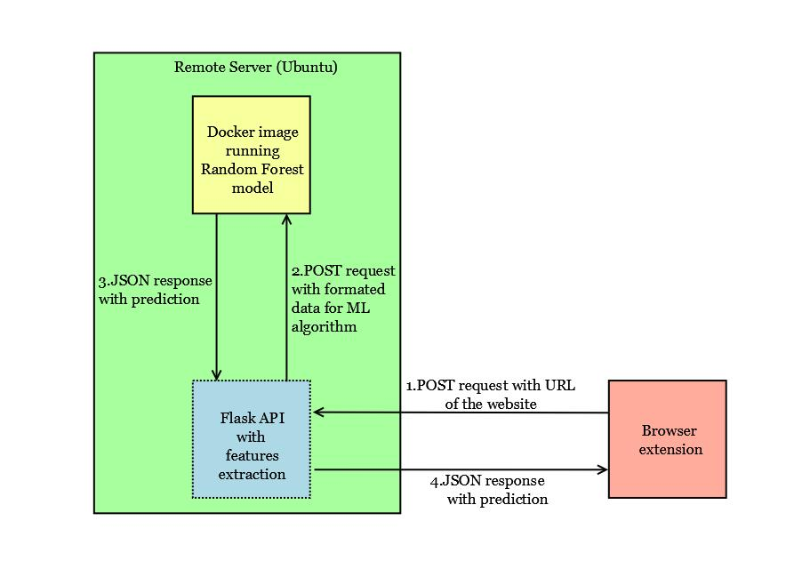
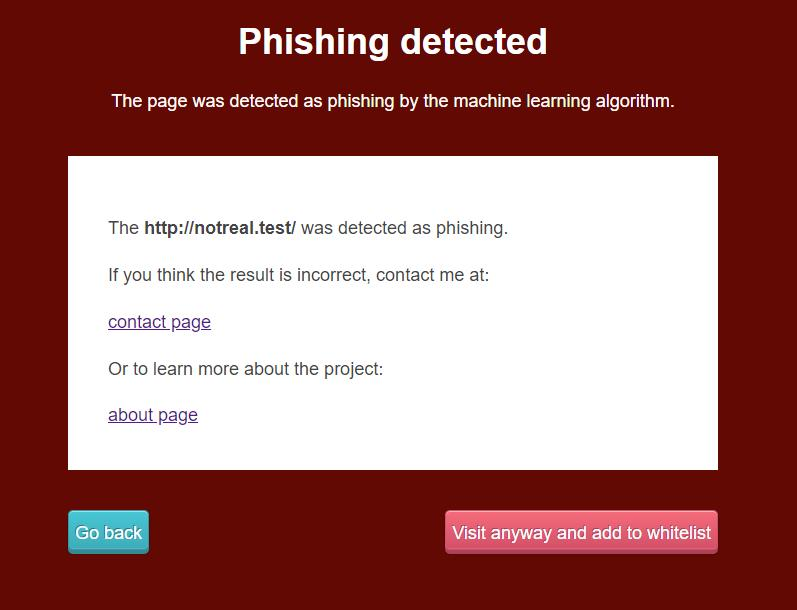
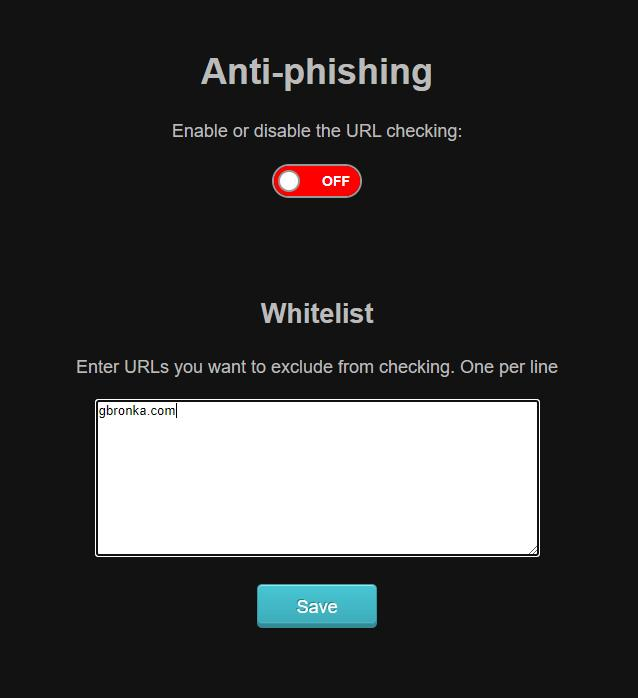
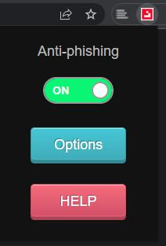

# Anti-phishing
Anti-phishing Chrome extension for my Honours project

The purpose of the project was to create a browser extension that prevents users from loading phishing websites. The project consisted of three components. The first component was a browser extension - a user interface for the project. The second component was an API translating raw URLs into data for the machine learning model. The last component, the machine learning model, analysed the data and predicted the probability of phishing. If the result from the server had a high probability, a user was blocked from loading the page. Several models were trained with a different set of features to find the most effective model.

* Frond-end - a Chrome extension using manifest v2. Redirects all queries to back end
* Back-end - a custom API written in Python converting the URLs into input for the ML model
* ModelTraining - the ML RandomForest model that was deployed to a Docker continer. It was developed with Tensorflow 2.5.1 and Tensorflow decision forests 0.1.8

### Overview of the archtecture:

### Example how a blocked page looks like:

### Extension settings:

### Settings in a popup:

